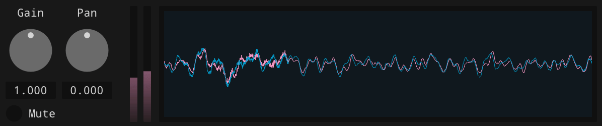

```
[..               [......    [..
[.. [... [.. [..  [..  [.. [.[. [.
[..  [..  [.  [.. [. [..     [..
[..  [..  [.  [.. [..  [..   [..
[..  [..  [.  [.. [..    [.. [..
```


[](https://github.com/mimic-sussex/eppEditor/blob/master/LICENSE)

# What is ImRt?

A framework for the developement of audio applications using __Dear ImGui__ with the backends __GLFW__ and __OpenGL__ as well as __ImPlot__ and __RtAudio__.

# How do I use ImRt?

Use this repository as a template:

```bash
git clone --recurse-submodules https://github.com/tonstein/imrt
rm -rf imrt/.git
mv imrt project-name
cd project-name
git init
code . # if you use VSCode
```

Work with a copy of one of the following examples and adjust the CMakeLists.txt in the root folder accordingly.

The most important classes of the framework are documented on [https://tonstein.github.io/imrt/](https://tonstein.github.io/imrt/).

## Examples

### Oscilloscope


See [examples/oscilloscope](examples/oscilloscope).

### Utility 



See [examples/utility](examples/utility).
